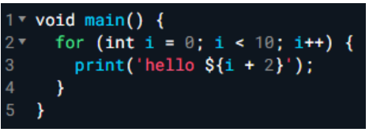
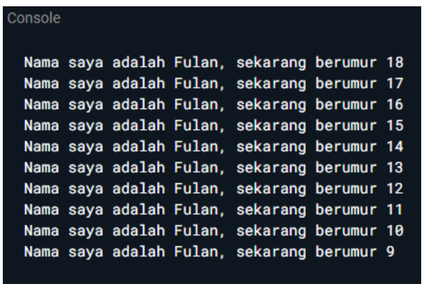

# Class dan Object

**Nama: Asyifa Nurfadilah**  
**Kelas: TI 3D**  
**NIM: 2241720257**

## Soal
1. Modifikasilah kode pada baris 3 di VS Code atau Editor Code favorit Anda berikut ini agar mendapatkan keluaran (output) sesuai yang diminta!  
      
    output yang diminta:
    

    kode:
    ```
    void main() {
        for (int i = 19; i > 9; i--) {
            print('Nama saya adalah Fulan, sekarang berumur ${i - 1}');
        }
    }

    ```
2. Mengapa sangat penting untuk memahami bahasa pemrograman Dart sebelum kita menggunakan framework Flutter ? Jelaskan!  
    dart adalah bahasa dasar yang digunakan dalam flutter. jadi, memahami sintaksis, struktur dan fitur-fitur dart akan memudahkan dalam menulis kode flutter secara efektif
3. Rangkumlah materi dari codelab ini menjadi poin-poin penting yang dapat Anda gunakan untuk membantu proses pengembangan aplikasi mobile menggunakan framework Flutter.
   -Dart menggabungkan beberapa kelebihan-kelebihan yang dimiliki bahasa tingkat tinggi seperti:
      - productive tooling, fitur kakas (tool) untuk menganalisis kode, plugin IDE, dan ekosistem paket yang besar.
      - garbage collection, untuk mengelola atau menangani dealokasi memori
      - portability, bahasa dart bisa dikompilasi secara native juga ke kode advanced RISC Machines(ARM) dan x86
      - statically typed, dart tetap aman menggunakan fitur type-safe dan type inference untuk menganalisis types saat runtime, yang penting untuk menemukan bug selama kompilasi kode
    - pengembangan framework flutter melibatkan banyak fitur mendalam dengan bahasa dart, sehingga memiliki pahaman yang kuat bahasa dart akan memudahkan  pengembang dalam pengembangan flutter
    - Dart, diluncurkan pada 2011, awalnya dirancang untuk pengembangan web sebagai alternatif JavaScript, dengan fokus pada kinerja dan skalabilitas proyek besar. Seiring waktu, Dart beralih fokus ke pengembangan mobile, terutama dengan framework Flutter. Versi stabilnya dirilis pada 2013, dan perubahan signifikan datang dengan Dart 2.0 pada 2018. Dart menawarkan:

      - Solusi untuk masalah JavaScript: Dart dirancang untuk memperbaiki kekurangan JavaScript dalam hal ketahanan dan struktur yang lebih baik.
      - Performa tinggi: Dart dilengkapi dengan alat modern yang mendukung kinerja optimal, sambil tetap mempertahankan fleksibilitas bahasa yang dinamis.
      - Fleksibilitas dan kekuatan: Dart menggabungkan anotasi tipe opsional dan fitur OOP, menyeimbangkan fleksibilitas dan ketangguhan.

    - Dart terus berkembang menjadi bahasa pemrograman lintas platform yang modern dan relevan, yang menjadikannya pilihan tepat untuk framework Flutter.

    - Dart dapat mengeksekusi kode dalam dua cara: Dart Virtual Machines (VMs) dan JavaScript compilations. Kode Dart bisa dijalankan di lingkungan yang mendukung Dart, yang membutuhkan runtime systems, Dart core libraries, dan garbage collectors.

        Dart mendukung dua mode kompilasi:

        - Just-In-Time (JIT): Kode sumber dikompilasi saat dibutuhkan, digunakan selama pengembangan aplikasi mobile dan mendukung fitur seperti debugging dan hot reload. Ini memungkinkan pengembang untuk melihat perubahan kode secara cepat.
        - Ahead-Of-Time (AOT): Kode dikompilasi sebelumnya, memberikan kinerja lebih baik tetapi tanpa fitur debugging dan hot reload.

        Fitur hot reload Dart, yang menggunakan JIT, memungkinkan pengembang melakukan perubahan kode secara langsung dan melihat hasilnya dengan cepat, mempercepat pengembangan dan meningkatkan kualitas aplikasi.

        - Dart memiliki struktur bahasa yang mirip dengan bahasa pemrograman lain seperti C atau JavaScript, dengan sintaks yang mudah dipahami. Berikut adalah beberapa konsep utama dalam Dart:

        Object-Oriented Programming (OOP): Dart mendukung konsep OOP, termasuk encapsulation, inheritance, composition, abstraction, dan polymorphism. Objek dalam Dart dibuat dari class, yang berisi fields (data) dan methods (kode). Bagi yang sudah memahami OOP di bahasa lain seperti Java, konsep ini akan sangat familiar.

         - Operators: Dart mendukung berbagai operator yang mirip dengan bahasa pemrograman lain:
        - Arithmetic operators: (+, -, *, /, ~/ untuk pembagian bilangan bulat, % untuk modulus).
        Increment dan decrement: (++, --) untuk menambah atau mengurangi nilai variabel.
        Equality and relational operators: (==, !=, >, <, >=, <=) untuk perbandingan nilai. Tidak seperti bahasa lain, operator == di Dart membandingkan isi variabel, bukan referensi memori.
        Logical operators: (! untuk negasi, || untuk OR, && untuk AND) diterapkan pada boolean (bool).

        Flexible Operators: Operator Dart tidak lebih dari metode yang didefinisikan dalam class, sehingga bisa dimodifikasi untuk logika yang diinginkan. Misalnya, x == y seolah memanggil x.==(y).

    - Untuk memahami dasar-dasar Dart, bisa menggunakan DartPad, kakas online untuk belajar dan bereksperimen dengan Dart. DartPad mendukung sebagian besar core library Dart, kecuali library VM seperti dart:io. bisa menulis dan menjalankan kode Dart langsung dari browser.
    - Function utama (main):

      - void: Menunjukkan bahwa function main tidak mengembalikan data.
      - main: Function utama yang dicari oleh Dart VM untuk memulai eksekusi kode.
      - Kurung (): Tempat untuk mendefinisikan parameter yang diterima oleh function (kosong dalam hal ini).
      - Kurung kurawal {}: Menandai awal dan akhir blok kode function.

   - Function vs Method:

      - Function: Kode yang berdiri sendiri, tidak berada dalam class (contoh: function main).
      - Method: Terikat pada objek atau class, mengakses instance melalui keyword this.
